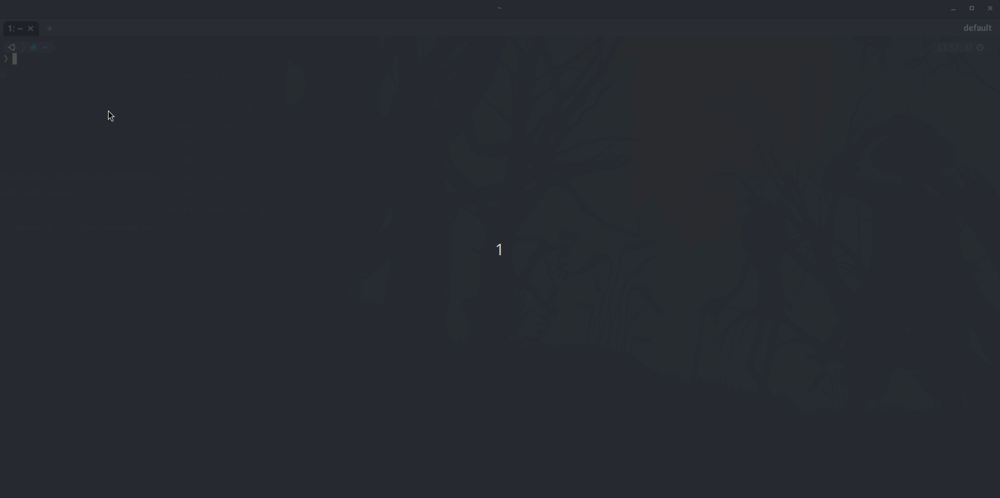

# WezTerm Sessions

The [WezTerm](https://wezfurlong.org/wezterm/) Sessions is a Lua script
enhancement for WezTerm that provides functionality to save, load, and restore
terminal sessions. This tool helps manage terminal sessions, its goal is to save
and restore different sessions or better workspaces and later restore them.



## Features

- **Save Session State** Captures the current layout of windows, tabs and panes,
  along with their working directories and foreground processes.
- **Restore Session** Reopens a previously saved session that matches the
  current workspace name, restoring its layout and directories.
- **Load Session** Allows selecting which saved session to
  load, regardless of the current workspace name.
- **Delete Session State** Allows selecting which saved session to
  delete, regardless of the current workspace name.

## Installation

1. **Add to your wezterm config**

   ```lua
    local sessions = wezterm.plugin.require("https://github.com/abidibo/wezterm-sessions")
    sessions.apply_to_config(config) -- optional, this adds default keybindings
   ```

## Configuration

2. **Event Bindings:** You can define your own keybindings:

    ```lua
    -- there are the default ones
    config.keys = {
        {
            key = 's',
            mods = 'ALT',
            action = act({ EmitEvent = "save_session" }),
        },
        {
            key = 'l',
            mods = 'ALT',
            action = act({ EmitEvent = "load_session" }),
        },
        {
            key = 'r',
            mods = 'ALT',
            action = act({ EmitEvent = "restore_session" }),
        },
        {
            key = 'd',
            mods = 'CTRL|SHIFT',
            action = act({ EmitEvent = "delete_session" }),
        },
    }
   ```

3. I also recommend to set up a keybinding for creating **named** workspaces or rename the current one:

    ````lua 
    -- Rename current workspace
    {
        key = '$',
        mods = 'CTRL|SHIFT',
        action = act.PromptInputLine {
            description = 'Enter new workspace name',
            action = wezterm.action_callback(
                function(window, pane, line)
                    if line then
                        wezterm.mux.rename_workspace(wezterm.mux.get_active_workspace(), line)
                    end
                end
            ),
        },
    },
    ```
   

## Limitations

There are currently some limitations and improvements that need to be
implemented:

- The script does not restore the state of running applications within each pane
  (except nvim on linux which seems to work fine but the general handling should
  be improved)
- It' primarily tested on Linux, expect some bugs or adjustements
  that need to be made

## Credits

This project is a fork of the original [WezTerm Session Manager](https://github.com/danielcopper/wezterm-session-manager) created by [Daniel Copper](https://github.com/danielcopper).

## Contributing

Feedback, bug reports, and contributions to enhance the script are welcome.
